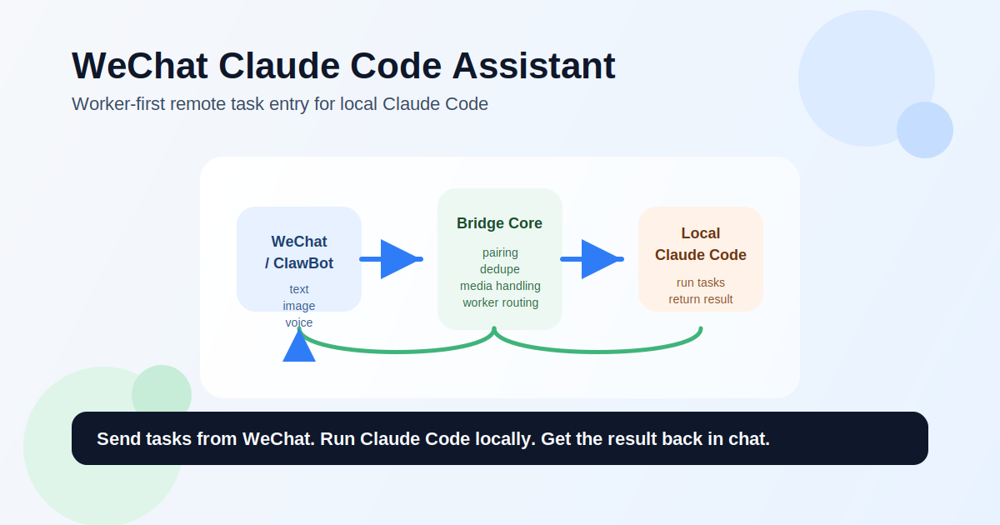
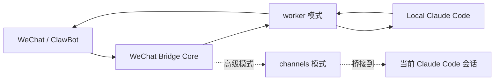

# 微信 Claude Code 助手



把微信变成本地 Claude Code 的远程任务入口。

你在手机上发一句话，本机上的 Claude Code 就开始干活。任务过程会回到微信，结果也会回到微信。你不需要一直守着终端，也不需要专门开一个网页面板。

这不是一个“只能演示”的桥接原型，而是一条已经跑通的本地使用路径：

- 微信发任务
- 本地后台 worker 执行
- Claude Code 处理代码或分析任务
- 结果自动回发微信

## English Summary

`wechat-claude-assistant` turns WeChat into a worker-first remote task entry for local Claude Code.

You send a message from WeChat. A local worker picks it up, runs Claude Code on your machine, and sends the result back to chat.

It supports:

- text
- image
- image + text
- image links
- webpage URLs
- webpage URLs + text
- uploaded documents (`pdf`, `docx`, `xlsx`, `pptx`, `md`, `txt`, ...)
- documents + text
- voice
- voice + text

The default path is `worker`, not `channels`, because the goal is daily usability rather than session-only protocol demos.

## 一眼看懂它怎么工作



## 新手 3 分钟上手

如果你是第一次接触这个项目，直接走这条路径，不要先折腾 `channels`。

### 你需要先准备好

- `Claude Code`
- `Node.js 18+`
- 一个能正常使用 ClawBot 的微信号

### 第一步：拉代码并安装

```bash
git clone https://github.com/itzone-x/wechat-claude-assistant.git
cd wechat-claude-assistant
npm install
npm run build
```

### 第二步：跑安装向导

```bash
node dist/cli.js install
```

向导会带你完成：

1. 环境检查
2. 微信扫码登录
3. 工作目录设置
4. 执行策略设置
5. 自动启动偏好保存

注意：这一步只会完成配置和微信登录，不会自动开始监听微信消息。

如果你在向导里选择了“开启自动启动”，安装结束后会尝试直接安装并启动本机服务。
如果服务成功拉起，安装结束时会直接打印一段精简状态摘要，告诉你当前 worker 是否已经在运行。

### 第三步：启动 worker

前台运行：

```bash
node dist/cli.js start
```

如果你希望它后台常驻：

```bash
node dist/cli.js start --daemon
```

只有看到终端输出 `worker 模式已启动`，微信里的消息才会收到回复。

如果你改用自动启动服务：

```bash
node dist/cli.js service install
node dist/cli.js service status
node dist/cli.js status
```

请先确认 `service status` 显示“已加载: 是”，并且 `status` 显示“worker 运行中: 是”，再去微信里发消息。

### 第一次验证

在微信里给 ClawBot 发：

```text
/echo 你好
```

如果收到回复，说明链路已经通了。

### 开始真实使用

直接在微信里发自然语言任务，例如：

```text
请检查当前项目的 README，告诉我主路径是不是 worker 模式，并简短总结。
```

也可以直接发：

- 文字
- 图片
- 图片 + 文字
- 图片链接
- 网页链接
- 网页链接 + 文字
- 文件附件
- 文件附件 + 文字
- 语音
- 语音 + 文字

### 常用命令

本地：

```bash
node dist/cli.js status
node dist/cli.js stop
node dist/cli.js service install
node dist/cli.js doctor
```

微信里：

- `/echo 你好`
- `/status`
- `/reset`
- `/help`

## 这是什么

这个项目基于微信官方 ClawBot iLink API，把微信接到本地 Claude Code 上。

它现在有两种模式：

- `worker`：主路径，也是推荐模式。适合真正拿来日常使用。
- `channels`：高级模式。适合已经在 Claude Code 终端里工作的高级用户，或者想研究 Claude Channels 的人。

简单说：

- 如果你想“在微信里给本地 Claude Code 派活”，用 `worker`
- 如果你想“把微信消息直接桥接进当前 Claude Code 会话”，才考虑 `channels`

## 这个产品解决了什么问题

Claude Code 很强，但它天然是“坐在电脑前”的工具。

现实里的问题是：

- 路上想到一个任务，得等回到电脑再开工
- 临时想让它先改点代码、跑点分析，手机上没入口
- 就算做了桥接，很多方案也停留在协议验证，离“稳定可用”还差很远

这个项目想解决的就是这件事：

> 让微信变成你本地 AI 开发代理的控制入口。

你可以在地铁上、开会间隙、吃饭路上，直接通过微信给本地 Claude Code 派任务。等你回到电脑前，代码可能已经改好了，结果也已经回到了微信。

## 为什么主路径是 worker，而不是 channels

我们一开始也研究过 Channels 路线。

它很先进，也很优雅，但有一个现实问题：它更适合“当前会话内桥接”，不太适合做普通用户的默认产品路径。它依赖当前 Claude Code 会话在线，也更容易受到认证方式和本地配置影响。

所以这个项目最后做出的决定很明确：

- `channels` 保留，但只作为高级模式
- `worker-first` 才是主产品路径

这个取舍背后的逻辑很简单。真正有价值的不是“微信能和 Claude 聊天”，而是“微信可以给本地 Claude Code 派活，而且这件事能稳定运行”。

## 快速开始

```bash
npm install
npm run build
node dist/cli.js install
```

安装向导会完成：

1. 环境检查
2. 模式选择
3. 微信扫码登录
4. 工作目录与执行策略设置
5. 自动启动偏好保存

完成后，推荐直接运行：

```bash
node dist/cli.js start
```

如果你希望它在后台常驻：

```bash
node dist/cli.js start --daemon
```

如果你希望它跟随 macOS 登录自动启动：

```bash
node dist/cli.js service install
```

安装完后，先验证它真的已经起来：

```bash
node dist/cli.js service status
node dist/cli.js status
```

只有当 `service status` 显示“已加载: 是”，并且 `status` 显示“worker 运行中: 是”，才说明微信消息已经有人在监听。

## 微信上怎么用

连通后，直接给 ClawBot 发消息即可。

常用命令：

- `/echo 你好`：连通性测试
- `/status`：查看当前任务状态
- `/reset`：重置当前微信会话对应的 Claude 会话
- `/help`：查看命令说明

普通任务直接发自然语言，例如：

```text
请检查当前项目的 README，告诉我主路径是不是 worker 模式，并简短总结。
```

现在也支持多模态输入：

- 直接发图片，让 Claude 只看图回答
- 发图片再补一句话，让 Claude 结合图片和文字一起理解
- 直接发图片链接，只要链接最终返回的是图片，也会先下载到本地再交给 Claude
- 直接发网页链接或公众号文章链接，bridge 会先抓取网页正文，再把可读文本交给 Claude
- 发网页链接再补一句话，让 Claude 结合网页内容和你的问题一起理解
- 直接上传文件附件，例如 `pdf`、`docx`、`xlsx`、`pptx`、`md`、`txt`
- 上传文件后再补一句话，让 Claude 结合附件内容和你的问题一起理解
- 直接发语音，优先使用微信自动转写内容理解；如果语音媒体可下载，也会把语音文件一并交给 worker
- 发语音再补一句话，让 Claude 结合转写文本、语音附件和文字一起理解

例如：

```text
请看这张报错截图，告诉我最可能的根因。
```

```text
请结合这张页面截图和我上面的描述，帮我判断 UI 为什么错位。
```

```text
请看这篇文章：https://example.com/article ，帮我提炼 3 个重点。
```

```text
我刚上传了一份 PDF，请结合文件内容告诉我核心结论。
```

worker 默认更安静：

- 正常情况下直接回最终结果
- 只有任务超过 5 秒还没完成，才补一条 `处理中，发送 /status 可查看进展。`
- 如果任务失败，会回 `任务执行失败：...`
- bridge 会对入站消息做短窗口去重，尽量避免语音、文字和多模态消息被重复回复

## 常用命令

```bash
node dist/cli.js install
node dist/cli.js login
node dist/cli.js start
node dist/cli.js start --daemon
node dist/cli.js stop
node dist/cli.js status
node dist/cli.js service status
node dist/cli.js service install
node dist/cli.js service uninstall
node dist/cli.js doctor
node dist/cli.js doctor --channels
node dist/cli.js doctor --fix
node dist/cli.js start --mode channels
```

## 当前这版已经做到什么程度

这不是纸面设计，主路径已经做过真实联调。

已验证内容包括：

- 真实微信扫码登录
- 真实微信 `/echo`
- 真实任务执行与结果回传
- 图片链接下载与多模态任务透传
- 纯图片任务与图片 + 文字混合理解
- 普通网页链接与公众号文章链接抓取
- `pdf` / `docx` / `xlsx` / `pptx` / `md` / `txt` 等附件透传与可读预处理
- 网页、附件和文字混合理解
- 微信语音转写接入与语音附件透传
- 入站消息去重与重复回复稳定性修复
- 后台 worker 运行
- macOS `launchd` 自动启动
- 同一微信会话下的并发任务拒绝
- Claude 会话恢复
- worker 与高级模式隔离，避免互相污染

自动化测试当前为：

- `88 / 88`

## 架构一眼看懂

```text
WeChat / ClawBot
        |
        v
WeChat Bridge Core
        |
        +--> worker 模式：本地后台执行 Claude Code
        |
        +--> channels 模式：桥接到当前 Claude Code 会话
```

从产品形态看，它不是一个“纯 SDK”，也不是一个“只有 Channel 的插件”。

更准确的说法是：

- 对用户，它是一个可安装、可后台运行的微信派活工具
- 对架构，它内部采用了 SDK 式桥接抽象
- 对高级用户，它保留了可选的 Channels 扩展层

## 这个项目和常见方案有什么不同

相近的方案大致有两类：

- 一类更像底层桥接 SDK
- 一类更像纯 Channels 插件

这个项目走的是第三条路：

- 吸收 SDK 的抽象能力
- 保留 Channels 的高级扩展能力
- 但把真正可用的本地主路径做成 `worker-first`

换句话说，它不是只证明“能接上”，而是想把“接上之后能稳定使用”这件事做出来。

## 文档入口

如果你想继续看：

- 版本变更：[`CHANGELOG.md`](CHANGELOG.md)
- 发布流程：[`RELEASING.md`](RELEASING.md)
- 发布说明：[`docs/releases/v0.2.0-url-and-document-understanding.md`](docs/releases/v0.2.0-url-and-document-understanding.md)
- 产品与架构说明：[`docs/product/wechat-claude-code-assistant-overview.md`](docs/product/wechat-claude-code-assistant-overview.md)
- 高级模式说明：[`docs/advanced/channels-mode.md`](docs/advanced/channels-mode.md)
- 使用指南：[`USAGE.md`](USAGE.md)

## 适合谁

- 想用微信给本地 Claude Code 派任务的人
- 不想一直开着一个交互式 Claude 会话的人
- 希望本地 Agent 能后台常驻的人
- 想研究“即时通信入口 + 本地 AI Agent”这类产品形态的人

## 开源协作

- 贡献说明：[`CONTRIBUTING.md`](CONTRIBUTING.md)
- 安全反馈：[`SECURITY.md`](SECURITY.md)
- 行为规范：[`CODE_OF_CONDUCT.md`](CODE_OF_CONDUCT.md)
- 许可证：[`LICENSE`](LICENSE)
- 发布流程：[`RELEASING.md`](RELEASING.md)
- GitHub 发布清单：[`docs/releases/github-open-source-checklist.md`](docs/releases/github-open-source-checklist.md)
- GitHub 仓库元信息：[`docs/releases/github-repository-metadata.md`](docs/releases/github-repository-metadata.md)

推荐只使用这组命令：

- `install`
- `login`
- `start`
- `service`
- `status`
- `doctor`
